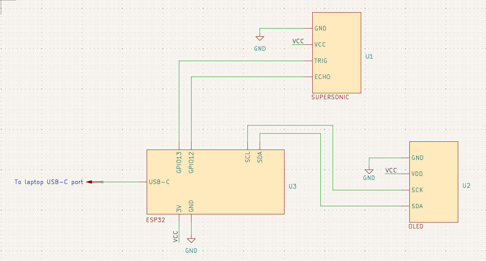
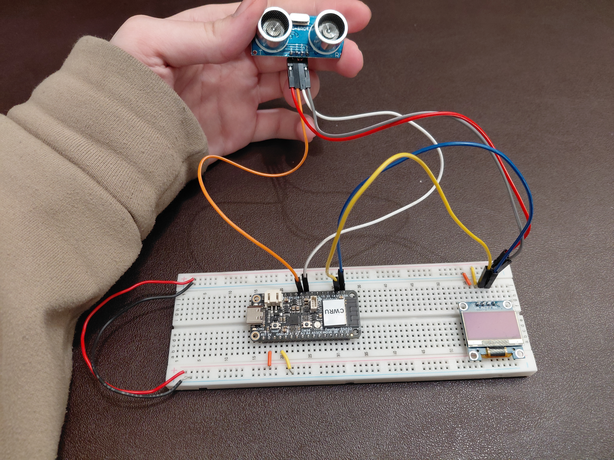

# Lab 5 - Sensor/Actuator Integration
**Andrew Manteau**

This is our last assignment working with the ESP32. We will be integrating sensors with actuators. I will use the PlatformIO IDE extension in VS Code to upload my code to the ESP32. I am using a Dell laptop running Windows 11. I've also configured `platformio.ini` with the `no-stub` tag to counteract issues I've experienced in the past with inconsistent upload success.

## My System

For this lab, I am integrating the OLED display with a supersonic distance meter to make a visual meter that shows how far away the supersonic meter's target is.

I want the screen to be totally dark when the distance between the supersonic sensor and its target is close to zero, and full when its target is over 100cm away, with a linear range in between.

The code to run this circuit, along with explanatory comments, is found in `src/main.cpp`.

The program initializes the OLED screen via the I2C connections, and then it begins a perpetual loop.

During each step of this loop, the program does the following:

1. Send a pulse to the supersonic sensor's `Trig` terminal to trigger the sensor and collect a data point.

2. Read the value fed back from the sensor's `Echo` terminal, and manipulate that value to determine the distance measured by the sensor.

3. Convert that value to a height to set the meter on the OLED screen to.

4. Redisplay the bitmap on the OLED screen, but shift it up or down depending on the value measured. Larger distances should fill more of the screen.

5. Wait 100ms to let everything stabilize before making another measurement.

Below are a simplified schematic of the circuit and a photo of the circuit.

Also included in the `images` folder is a video of the circuit functioning as intended.

As you can see, the video output can be a little jerky, but it generally is able to keep somewhat stable. This could be mitigated on future revisions by maintaining a short-term rolling average of distances measured to prevent the output from responding so sharply to random noise.

## Time Reporting & Reflection

1. This assignment took approxiamtely 3-4 hours to complete.

2. Medium

3. The most difficult part of this assignment was figuring out how to get the OLED display to run. I referenced the Sunfounder website for guidance on the code and libraries necessary to get it up and running quickly. I ran into further issues as I tried to use the SCK pin on the ESP32 for the I2C clock, when I should have been using the SCL pin. Through trial and error, as well as research, I was able to get everything working successfully in the end.

4. I feel somewhat comfortable with the course content. Our team sometimes feels somewhat overloaded with work at times, but we are still meeting deadlines and have good ideas for our design.

5. N/A