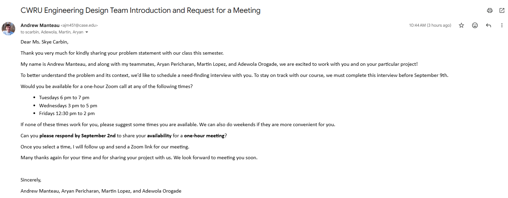

# Lab Notebook - Week 1

**Andrew Manteau**

This Wednesday, Aug 26, our team was formed, and we began ranking our project choices on that same day.

## Project Ranking - August 26

To choose how to rank our design project choices, we met in person at the end of class on Aug 26 to discuss how we each felt about the available options.

After approximately 10 minutes, we came to  a consensus and submitted the ranking assignment.

## Stakeholder Email Drafting - August 27/28

On Aug 27, we met in person in Glennan building to draft our email to our stakeholder together.

At this meeting, we discussed available times so that we could provide the stakeholder with a few times during the week during which we could all meet with her.

We also agreed that I, Andrew, would send the email to the stakeholder.

The morning of Aug 28, I sent our drafted message to the stakeholder.

## Team Contract - August 28

On Aug 28, at 1:30 PM, we met in person in the student lounge in Glennan to construct our team contract.

At this meeting, we discussed who wanted to take on which roles listed in the Team Contract, and we created a Reviewer role with responsibilities ideated by various members and agreed to by Adewola, the reviewer.

We also each ideated new expectations for our team to add to the provided team expectations.

Finally, we each signed and dated the lines at the bottom of the sheet, and Aryan submitted the assignment around 2:00 PM.

Minutes were not taken at any of the meetings thus far, but they will be taken by me, the Secretary, hereforth.